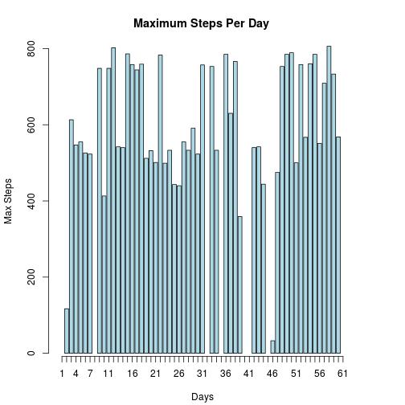
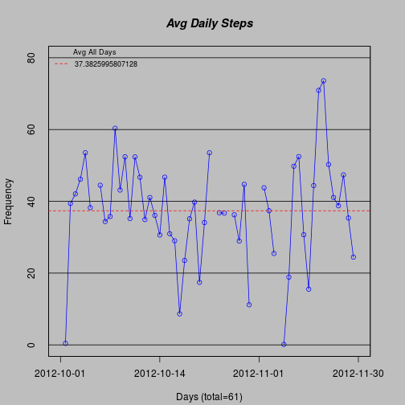
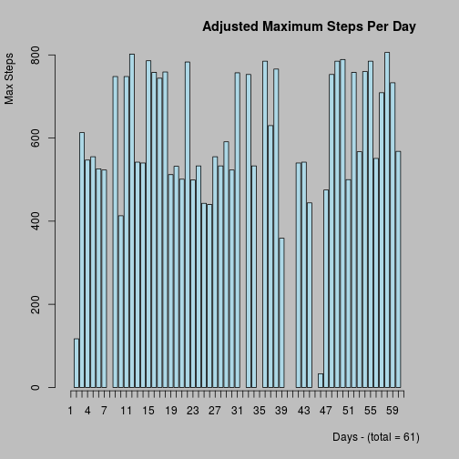

## Reproducible Research Peer Assessment 1
<p>
We can now download large amounts of data about personal movement
using activity monitoring devices. Data remains under-utilized due to
many two factors - data is hard to obtain and lack of statistical methods
to process and interpret the data.
</p>
### The data for this assignment was  downloaded from the course web site:
### Date : "02/10/2015"
### Dataset: Activity monitoring data [52K]

Variables for this dataset : steps , date, interval(identifier for 5 min. interval)

First load some useful libraries  :


```r
library(reshape2)
library(ggplot2)   
library(dplyr)
library(lubridate)
```


```
## Loading required package: methods
## 
## Attaching package: 'dplyr'
## 
## The following object is masked from 'package:stats':
## 
##     filter
## 
## The following objects are masked from 'package:base':
## 
##     intersect, setdiff, setequal, union
```
<!-- url <- "https://d396qusza40orc.cloudfront.net/repdata%2Fdata%2Factivity.zip"  -->
<!-- if (!file.exists("data/data.zip"))  -->
<!--    download.file(url, destfile = "data/data.zip", mode="wb")   -->

Reading the data in with read.csv, and setting up directories:

```r
# url from class link
if (!file.exists("data")) 
    dir.create("data")

if (!file.exists("data/activity.csv"))   
    unzip("activity.zip", exdir="data")

df <- read.csv("data/activity.csv",header=TRUE)
```


```r
nrow(df)			# to get total number of rows  [1] 17568
```

```
## [1] 17568
```

```r
names(df)			# to get column names [1] "steps"    "date"     "interval"
```

```
## [1] "steps"    "date"     "interval"
```

```r
dim(df)				# [1] 17568     3
```

```
## [1] 17568     3
```


Now for some quick analysis to see if it matches what we are suppose to get.
Preprocessing the  data, and converting to long format.

```r
mdf <- melt(df, id.vars = c("date","interval") )	# melt data into usable format 
str(mdf)				# 'data.frame':   17568 obs. of  4 variables:
```

```
## 'data.frame':	17568 obs. of  4 variables:
##  $ date    : Factor w/ 61 levels "2012-10-01","2012-10-02",..: 1 1 1 1 1 1 1 1 1 1 ...
##  $ interval: int  0 5 10 15 20 25 30 35 40 45 ...
##  $ variable: Factor w/ 1 level "steps": 1 1 1 1 1 1 1 1 1 1 ...
##  $ value   : int  NA NA NA NA NA NA NA NA NA NA ...
```


Now that we have the data downloaded to R , we can format the data
into an easier format to work with and group by day.


```r
mdftbl <- tbl_df(mdf)      				# for selection
mdftbl$date <-   as.Date(mdftbl$date)  			# convert to date format
```

<!--   head(mdftbl)     --> 
<!--   date            interval variable value     --> 
<!--    2012-10-01        0     steps     NA       -->


The mean total number of steps per day ,or daily mean, can be calculated with the following R code:

```r
bydate <- mdftbl %>% 
       		group_by(date) %>%
       		summarise(dailymean = mean(value,na.rm=TRUE))
```


<!--  37.3826  removes all NaN's  -->
1. Mean Total Number of steps taken per day :

```r
mean(bydate$dailymean,na.rm=TRUE)     
```

```
## [1] 37.3826
```

<!-- some fancy plotting -->
2. Histogram of total (maximum) number of steps taken per day. 


```r
maxbydate <- mdftbl %>%
                group_by(date) %>%
                summarise(dailymax = max(value,na.rm=TRUE))

par(mar=c(4.2, 4.2, 4.0, 4.2))
m <- barplot(  maxbydate$dailymax , main = "Maximum Steps Per Day " ,
            col="lightblue",
            xlab="Days",
            ylab="Max Steps"
        )
axis(1, at=m,labels=1:61)
```

 

3. Calculate mean and median of total number of steps taken per day.

```r
mean(maxbydate$dailymax,na.rm=T) 
```

```
## [1] 600.8868
```

```r
median(maxbydate$dailymax,na.rm=T)
```

```
## [1] 555
```

What is the Average Daily Activity pattern?
1. Make a time series plot of the 5 minute interval (x axis), and average number of steps taken, 
averaged across all days (y axis).

```r
par(mar=c(4.2, 4.2, 4.0, 3.0),bg="grey")  # default adj = 0, left = 0,center, 1 = right =1
plot(bydate$dailymean,
    type="o",
    col="blue",
    tck=1,
    xaxt="n",
    ylim=range(0:80),
    ann=FALSE)

box()
title(main="Avg Daily Steps", col.main="black", font.main=4)
# Label the x and y axes 
title(xlab="Days (total=61)", col.lab=rgb(0,0,0))
title(ylab="Frequency", col.lab=rgb(0,0,0))
abline(mean(bydate$dailymean,na.rm=TRUE),0,col="red",lty=2 )
legend("topleft",legend=mean(bydate$dailymean,na.rm=T),lty=2,col="red",bty="n",cex=0.75,title="Avg All Days",border="black",bg="white")
axis(1, at= seq(1,80,by=20), lab=c("2012-10-01","2012-10-14","2012-11-01","2012-11-30"))
```

 

Which 5 minute interval, on average across all days in dataset, 
contains the maximum number of steps?

```r
msteps <-  max(df$steps,na.rm =T)    # [1] 806
df[df$steps %in% msteps,]            # yea!
```

```
##       steps       date interval
## 16492   806 2012-11-27      615
```


Inputing missing values
1. calculate and report the total number of missing values in the data set.

```r
sum( is.na( df$steps ) )   
```

```
## [1] 2304
```

2. Devise a strategy for filling in all of the missing values in the dataset. 
The strategy does not need to be sophisticated. For example, you could use the 
mean/median for that day, or the mean for that 5-minute interval, etc.
<!-- bydate <- mdftbl %>%                       -->
<!--           group_by(date) %>%               -->
<!--           summarise(dailymean = mean(value,na.rm=TRUE))  -->


```r
bydate2 <- mdftbl %>%
	group_by(date) %>%
	summarise(dailymean = mean(value,na.rm=TRUE))
```


3. Create a new dataset that is equal to the original dataset but with the missing data filled in.
   Code is shown above, below are shown the new values.

```r
head(bydate2)
```

```
## Source: local data frame [6 x 2]
## 
##         date dailymean
## 1 2012-10-01       NaN
## 2 2012-10-02   0.43750
## 3 2012-10-03  39.41667
## 4 2012-10-04  42.06944
## 5 2012-10-05  46.15972
## 6 2012-10-06  53.54167
```

```r
tail(bydate2)
```

```
## Source: local data frame [6 x 2]
## 
##         date dailymean
## 1 2012-11-25  41.09028
## 2 2012-11-26  38.75694
## 3 2012-11-27  47.38194
## 4 2012-11-28  35.35764
## 5 2012-11-29  24.46875
## 6 2012-11-30       NaN
```

```r
dim(bydate2)
```

```
## [1] 61  2
```


4. Make a histogram of the total (Maximum) number of steps taken each day and calculate 
   and report the mean and median total number of steps taken per day. Do these values differ 
   from the estimates from the first part of the assignment? 

   By adding means you do not get a change in the mean and median. You do get a change in the histogram.
   

   What is the impact of inputing missing data on the estimates of the total daily number of steps?
   You get more values exactly equal to the mean so the standard deviation is smaller.


```r
meanbydate2 <- mdftbl %>%
	group_by(date) %>%
	summarise(dailymean = mean(value))   # no need for na.rm=TRUE

maxbydate2 <- mdftbl %>%
        group_by(date) %>%
        summarise(dailymax = max(value))     # no need for na.rm=TRUE

par(mar=c(5.2, 4.2, 4.0, 3.0),bg="grey",adj=1) 
m <- barplot(  maxbydate2$dailymax , main = "Adjusted Maximum Steps Per Day " ,
            col="lightblue",
            xlab="Days - (total = 61)",
            ylab="Max Steps"
        )
axis(1, at=m,labels=1:61)
```

 


Mean and Median of histogram is shown below.

```r
mean(bydate2$dailymean,na.rm=T)
```

```
## [1] 37.3826
```

```r
median(bydate2$dailymean,na.rm=T)
```

```
## [1] 37.37847
```

Are there differences in activity patterns between weekdays and weekends?
For this part the weekdays() function may be of some help here. Use the dataset with the filled-in missing values for this part.

1)  Create a new factor variable in the dataset with two levels – “weekday” and “weekend” indicating whether a given date is a weekday or weekend day.
<!-- bydate2  = bydate2$date + bydate2$ dailymean -->
<!--  weekdays(as.Date("2012-10-01",format='%Y-%m-%d'))     == "Monday" -->
<!--  weekdaze <- c("Monday","Tuesday","Wednesday","Thursday","Friday") -->


```r
weekdate2 <-  	bydate2 %>%
		mutate(week = ifelse(wday(ymd(bydate2$date,label=TRUE), wday(bydate2$week) ,week)))
```

```
## Warning: 1 failed to parse.
```

```
## Error in as.POSIXlt.default(x, tz = tz(x)): do not know how to convert 'x' to class "POSIXlt"
```


2)  Make a panel plot containing a time series plot (i.e. type = "l") of the 5-minute interval (x-axis) and the average number of steps taken, averaged across all weekday days or weekend days (y-axis). See the README file in the GitHub repository to see an example of what this plot should look like using simulated data.

<!-- Never got to the final question AAAAAAAAAAAAUGH -->


```r
par(mfrow=c(2,1))
plot(data2weekdays,type="l",
    col="blue",
    xaxt="n",
    ylim=range(0:100),
    ann=FALSE)
```

```
## Error in plot(data2weekdays, type = "l", col = "blue", xaxt = "n", ylim = range(0:100), : object 'data2weekdays' not found
```

```r
    box()
```

```
## Error in box(): plot.new has not been called yet
```

```r
title(main="Weekday Plot", col.main="black", font.main=4)
```

```
## Error in title(main = "Weekday Plot", col.main = "black", font.main = 4): plot.new has not been called yet
```

```r
# Label the x and y axes 
title(xlab="Days (total=61)", col.lab=rgb(0,0,0))
```

```
## Error in title(xlab = "Days (total=61)", col.lab = rgb(0, 0, 0)): plot.new has not been called yet
```

```r
title(ylab="Frequency", col.lab=rgb(0,0,0))
```

```
## Error in title(ylab = "Frequency", col.lab = rgb(0, 0, 0)): plot.new has not been called yet
```

```r
abline(mean(bydate$dailymean,na.rm=TRUE),0,col="red",lty=2 )
```

```
## Error in int_abline(a = a, b = b, h = h, v = v, untf = untf, ...): plot.new has not been called yet
```

```r
legend("topleft",legend=mean(bydate$dailymean,na.rm=T),lty=2,col="red",bty="n",cex=0.75,title="Avg All Days",border="black",bg="white")
```

```
## Error in strwidth(legend, units = "user", cex = cex, font = text.font): plot.new has not been called yet
```

```r
axis(1, at= seq(1,80,by=20), lab=c("2012-10-01","2012-10-14","2012-11-01","2012-11-30"))
```

```
## Error in axis(1, at = seq(1, 80, by = 20), lab = c("2012-10-01", "2012-10-14", : plot.new has not been called yet
```

```r
plot(data2weekends,type="l",
    col="blue",
    xaxt="n",
    ylim=range(0:100),
    ann=FALSE)
```

```
## Error in plot(data2weekends, type = "l", col = "blue", xaxt = "n", ylim = range(0:100), : object 'data2weekends' not found
```

```r
    box()
```

```
## Error in box(): plot.new has not been called yet
```

```r
title(main="Weekend  Plot", col.main="black", font.main=4)
```

```
## Error in title(main = "Weekend  Plot", col.main = "black", font.main = 4): plot.new has not been called yet
```

```r
# Label the x and y axes 
title(xlab="Days (total=61)", col.lab=rgb(0,0,0))
```

```
## Error in title(xlab = "Days (total=61)", col.lab = rgb(0, 0, 0)): plot.new has not been called yet
```

```r
title(ylab="Frequency", col.lab=rgb(0,0,0))
```

```
## Error in title(ylab = "Frequency", col.lab = rgb(0, 0, 0)): plot.new has not been called yet
```

```r
abline(mean(bydate$dailymean,na.rm=TRUE),0,col="red",lty=2 )
```

```
## Error in int_abline(a = a, b = b, h = h, v = v, untf = untf, ...): plot.new has not been called yet
```

```r
legend("topleft",legend=mean(bydate$dailymean,na.rm=T),lty=2,col="red",bty="n",cex=0.75,title="Avg All Days",border="black",bg="white")
```

```
## Error in strwidth(legend, units = "user", cex = cex, font = text.font): plot.new has not been called yet
```

```r
axis(1, at= seq(1,80,by=20), lab=c("2012-10-01","2012-10-14","2012-11-01","2012-11-30"))
```

```
## Error in axis(1, at = seq(1, 80, by = 20), lab = c("2012-10-01", "2012-10-14", : plot.new has not been called yet
```

```r
par(mfrow=c(1,1))
```


